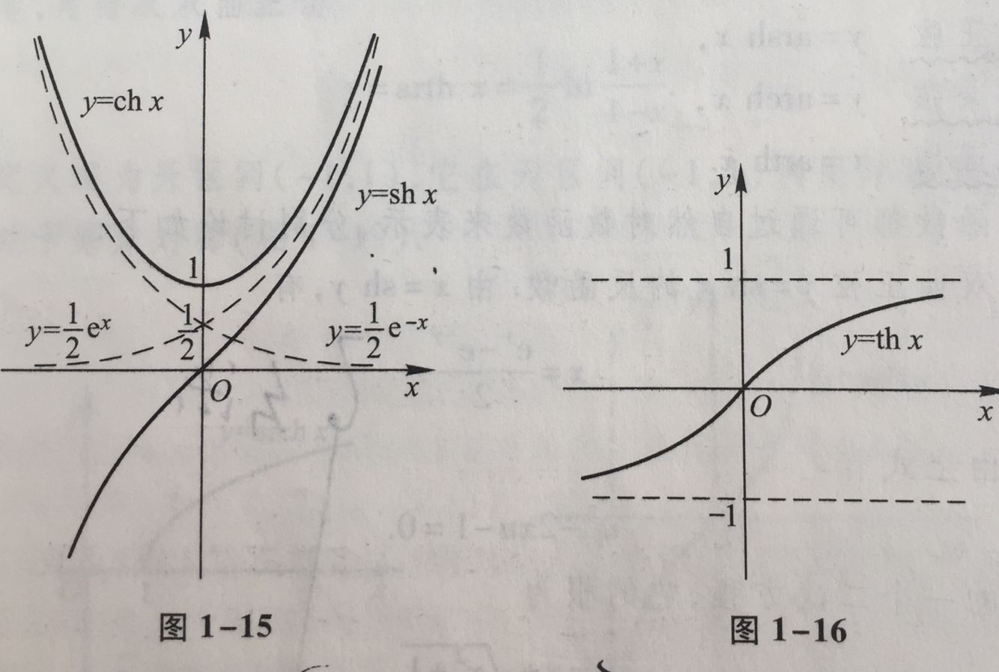
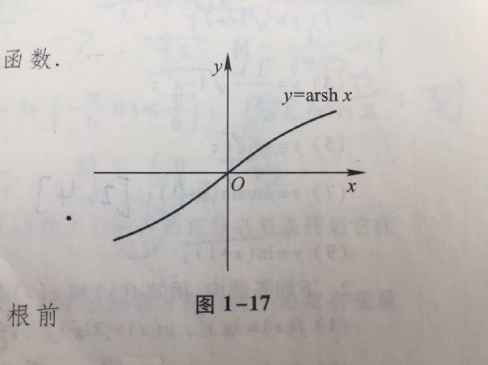
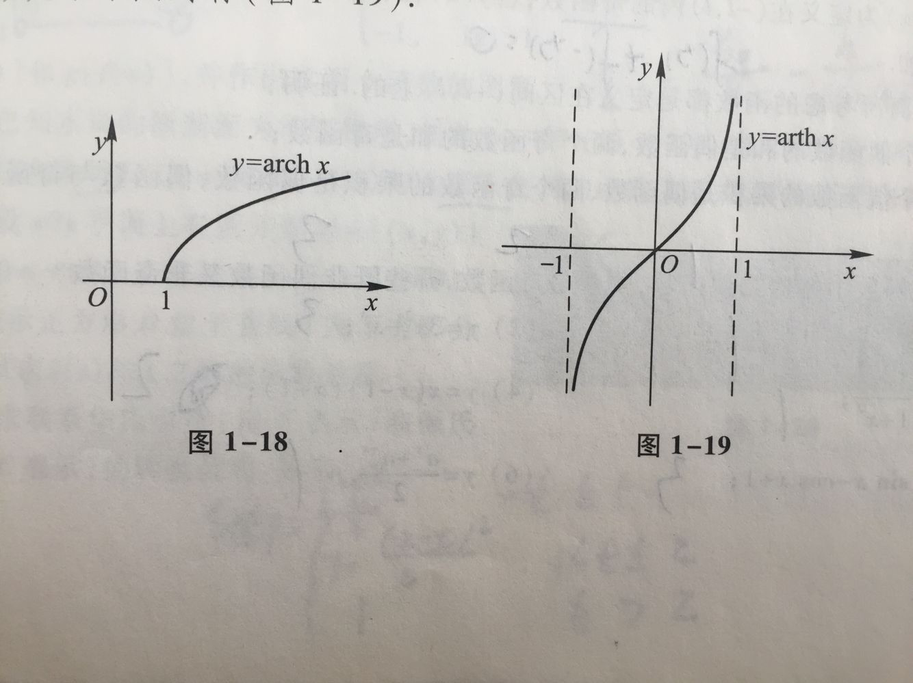

### 双曲正弦，双曲余弦，双曲正切
1. 双曲正弦：$\sh x=\frac{e^{x}-e^{-x}}{2}$
	- 定义域:$(-\infty,\infty)$
	- 奇函数
	- 整个定义域内单调递增
2. 双曲余弦：$\ch x=\frac{e^{x}+e^{-x}}{2}$
	- 定义域:$(-\infty,\infty)$
	- 偶函数,经过(0,1)点
	- 在x正半轴递增,负半轴递减
3. 双曲正弦：$\th x=\frac{e^{x}-e^{-x}}{e^{x}+e^{-x}}$
	- 定义域:$(-\infty,\infty)$
	- 奇函数，图形夹在(-1,1)之间
	- 整个定义域内递增

图像：

相关计算公式(和三角公式一样)：
- $\sh(x+y)=\sh x\ch y+\ch x\sh y$
- $\sh(x-y)=\sh x\ch y-\ch x\sh y$
- $\ch(x+y)=\ch x\ch y+\sh x\sh y$
- $\ch(x-y)=\ch x\ch y-\sh x\sh y$
---
### 反双曲
- $y=arsh(x)=\ln(x+\sqrt{x^{2}+1})$
	- 定义域:$(-\infty,\infty)$
	- 奇函数
	- 整个定义域内递增
- $y=arch(x)=\ln(x+\sqrt{x^{2}-1})$
	- 定义域:$[1,\infty)$
	- 整个定义域内单调递增
- $y=arth(x)=\frac{1}{2}\ln(\frac{1+x}{1-x})$
	- 定义域:$(-1,1)$
	- 奇函数
	- 整个定义域内单调递增

图像：

---
$
\begin{aligned}
求反双曲正弦的方法&\\
交换变量得到:&x=\frac{e^{y}+e^{-y}}{2},令u=e^y 得\\
&x=\frac{u+u^{-1}}{2}\\
&u^{2}+2xu+1=0\\
根据两根公式解得:&u=\frac{-2x \pm \sqrt{(2x)^2-4}}{2}=-x \pm \sqrt{x^2-1}\\
因为x>sqrt{x^2-1} &且-x \pm \sqrt{x^2-1}必须大于0\\
所以将u=e^y带入得到&:y=\ln(x+\sqrt{x^2-1})
\end{aligned}
$

----

### 之间的导数关系
$
\begin{aligned}
&(\sh x)`=\ch x,(\ch x)`=\sh x,(\th x)`=\frac{1}{\ch^2 x}\\
&(arsh x)`=\frac{1}{\sqrt{1+x^2}},(arch x)`=\frac{1}{\sqrt{x^2-1}},(arth x)`=\frac{1}{\sqrt{1-x^2}}\\
&(\frac{e^{x}-e^{-x}}{2} )`=\frac{e^{x}+e^{-x}}{2},(\frac{e^{x}+e^{-x}}{2})`=\frac{e^{x}-e^{-x}}{2} ,(\frac{e^{x}-e^{-x}}{e^{x}+e^{-x}})`=\frac{1}{(\frac{e^{x}+e^{-x}}{2})^2}\\
&(\ln(x+\sqrt{x^{2}+1}))`=\frac{1}{\sqrt{1+x^2}},(\ln(x+\sqrt{x^{2}-1}))`=\frac{1}{\sqrt{x^2-1}},(\frac{1}{2}(\frac{1+x}{1-x}))`=\frac{1}{\sqrt{1-x^2}}\\
&\end{aligned}
$

